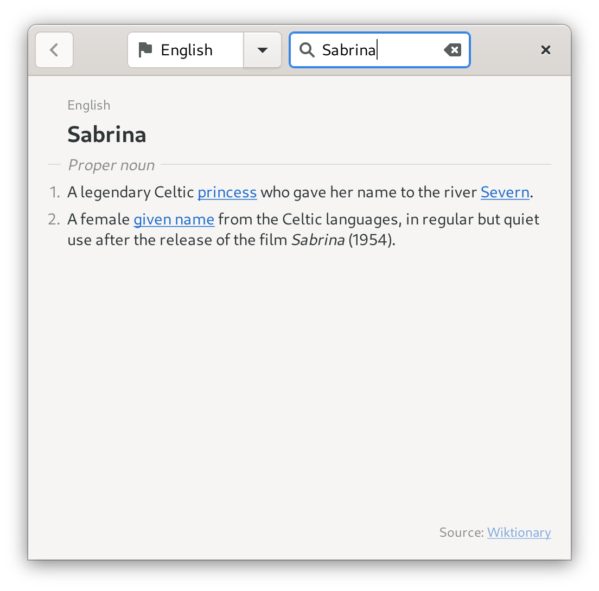

# Quick Lookup

Quick Lookup is a simple GTK dictionary application powered by [Wiktionary](https://en.wiktionary.org/)™.



## Features

- Lookup definitions for words or phrases using the [Wikimedia REST API of Wiktionary](https://en.wiktionary.org/api/rest_v1/#/Page%20content/get_page_definition__term_)
- Choose language by entering language name or ISO-639-1 code (e.g., "English" or "en")
- Open internal links within the app
- Go back to previous page with the back button
- Look up selected text from any app by setting a keyboard shortcut to launch this app with the `--selection` command line option

## Installation

Dependencies:

- `gjs (>= 1.70)`
- `gtk4`
- `libadwaita (>= 1.4)`
- `webkitgtk-6.0`

To install, run `meson builddir && sudo meson install -C builddir`

To uninstall, run `sudo meson uninstall -C builddir`

An [AUR package](https://aur.archlinux.org/packages/quick-lookup/) is available for Arch Linux and derivatives.

### Run without installing

```bash
gjs quick-lookup.js
```

### Flatpak

<a href="https://flathub.org/apps/details/com.github.johnfactotum.QuickLookup"></a>

#### Building Flatpaks manually

##### Using Gnome Builder
Open [Gnome Builder](https://wiki.gnome.org/Apps/Builder), choose "Clone Repository…", and follow the instructions. After cloning the project, hit Ctrl+F5 to build and run.

##### Using `flatpak-builder`

```bash
flatpak-builder --force-clean --install --user build com.github.johnfactotum.QuickLookup.json
```

## FAQ

### Why does it only support English Wiktionary?

This app only supports the [English version](https://en.wiktionary.org/) of [Wiktionary](https://www.wiktionary.org/). This means that you can lookup all words of all languages and find their definitions and descriptions in English.

This is because Wiktionary's definition API is currently only available for English. Explanation from [MediaWiki](https://www.mediawiki.org/wiki/Wikimedia_Apps/Wiktionary_definition_popups_in_the_Android_Wikipedia_app):

> Wiktionary content is unstructured, and presenting a concise set of definitions requires parsing them from the page HTML. English Wiktionary has an entry layout guide which assisted in this for the current English-only implementation. 

### Why is WebKit a dependency?

Because I'm lazy and I used the DOM APIs provided by WebKit to manipulate HTML markups.

### Will you add support for other online/offline dictionaries?

Probably not, because I'm lazy.

---

Wiktionary is a trademark of the Wikimedia Foundation. This program is not endorsed by or affiliated with the Wikimedia Foundation.
